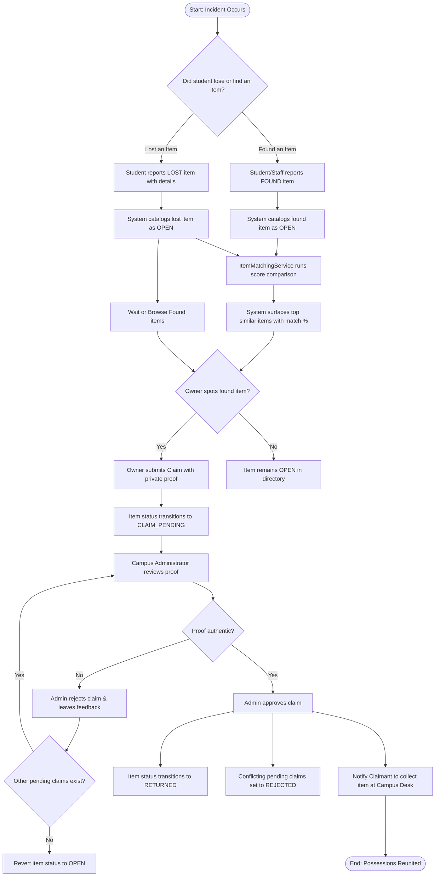

# CampusFind — Activity Diagram: Campus Recovery Workflow

```mermaid
flowchart TD
    Start([Start: Incident Occurs]) --> Choice{Did student lose or find an item?}
    
    %% Lost Workflow
    Choice -->|Lost an Item| ReportLost[Student reports LOST item with details]
    ReportLost --> SystemCatalog1[System catalogs lost item as OPEN]
    SystemCatalog1 --> BrowseOrWait[Wait or Browse Found items]
    
    %% Found Workflow
    Choice -->|Found an Item| ReportFound[Student/Staff reports FOUND item]
    ReportFound --> SystemCatalog2[System catalogs found item as OPEN]
    
    %% Matching
    SystemCatalog2 --> MatchAlgorithm[ItemMatchingService runs score comparison]
    SystemCatalog1 --> MatchAlgorithm
    MatchAlgorithm --> DisplaySuggestions[System surfaces top similar items with match %]
    
    %% Claiming
    DisplaySuggestions --> OwnerIdentifies{Owner spots found item?}
    BrowseOrWait --> OwnerIdentifies
    OwnerIdentifies -->|Yes| SubmitClaim[Owner submits Claim with private proof]
    OwnerIdentifies -->|No| AwaitManual[Item remains OPEN in directory]
    
    SubmitClaim --> StatusPending[Item status transitions to CLAIM_PENDING]
    StatusPending --> AdminReview[Campus Administrator reviews proof]
    
    AdminReview --> ValidProof{Proof authentic?}
    ValidProof -->|No| RejectClaim[Admin rejects claim & leaves feedback]
    RejectClaim --> CheckOther{Other pending claims exist?}
    CheckOther -->|Yes| AdminReview
    CheckOther -->|No| RevertOpen[Revert item status to OPEN]
    
    ValidProof -->|Yes| ApproveClaim[Admin approves claim]
    ApproveClaim --> MarkReturned[Item status transitions to RETURNED]
    ApproveClaim --> AutoRejectOthers[Conflicting pending claims set to REJECTED]
    ApproveClaim --> SendAlerts[Notify Claimant to collect item at Campus Desk]
    SendAlerts --> End([End: Possessions Reunited])
```
