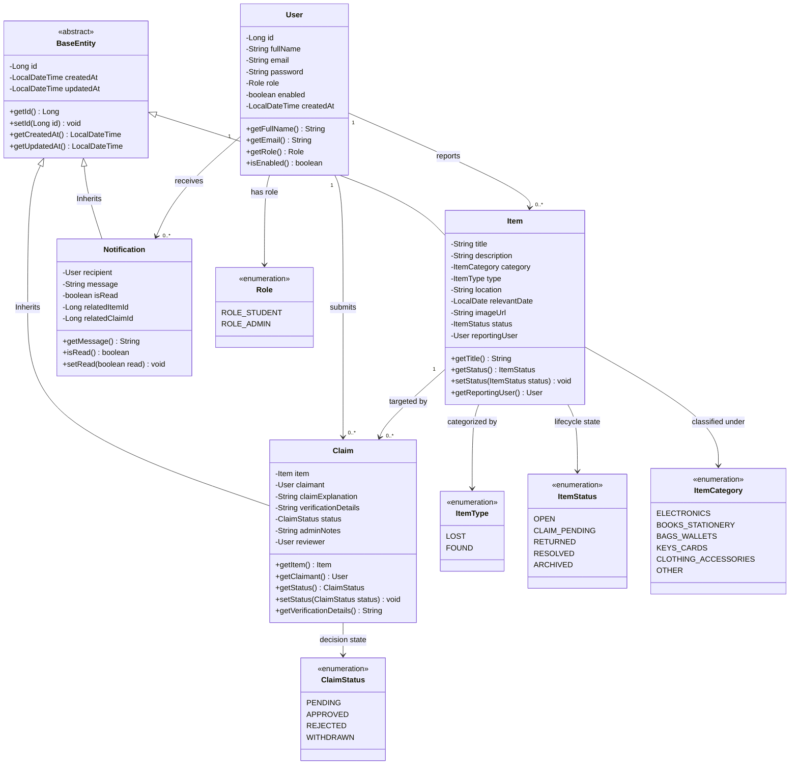

# CampusFind — Class Diagram (Java OOP Architecture)

```mermaid
classDiagram
    direction TB

    class BaseEntity {
        <<abstract>>
        -Long id
        -LocalDateTime createdAt
        -LocalDateTime updatedAt
        +getId() Long
        +setId(Long id) void
        +getCreatedAt() LocalDateTime
        +getUpdatedAt() LocalDateTime
    }

    class User {
        -Long id
        -String fullName
        -String email
        -String password
        -Role role
        -boolean enabled
        -LocalDateTime createdAt
        +getFullName() String
        +getEmail() String
        +getRole() Role
        +isEnabled() boolean
    }

    class Item {
        -String title
        -String description
        -ItemCategory category
        -ItemType type
        -String location
        -LocalDate relevantDate
        -String imageUrl
        -ItemStatus status
        -User reportingUser
        +getTitle() String
        +getStatus() ItemStatus
        +setStatus(ItemStatus status) void
        +getReportingUser() User
    }

    class Claim {
        -Item item
        -User claimant
        -String claimExplanation
        -String verificationDetails
        -ClaimStatus status
        -String adminNotes
        -User reviewer
        +getItem() Item
        +getClaimant() User
        +getStatus() ClaimStatus
        +setStatus(ClaimStatus status) void
        +getVerificationDetails() String
    }

    class Notification {
        -User recipient
        -String message
        -boolean isRead
        -Long relatedItemId
        -Long relatedClaimId
        +getMessage() String
        +isRead() boolean
        +setRead(boolean read) void
    }

    class Role {
        <<enumeration>>
        ROLE_STUDENT
        ROLE_ADMIN
    }

    class ItemType {
        <<enumeration>>
        LOST
        FOUND
    }

    class ItemStatus {
        <<enumeration>>
        OPEN
        CLAIM_PENDING
        RETURNED
        RESOLVED
        ARCHIVED
    }

    class ClaimStatus {
        <<enumeration>>
        PENDING
        APPROVED
        REJECTED
        WITHDRAWN
    }

    class ItemCategory {
        <<enumeration>>
        ELECTRONICS
        BOOKS_STATIONERY
        BAGS_WALLETS
        KEYS_CARDS
        CLOTHING_ACCESSORIES
        OTHER
    }

    BaseEntity <|-- Item : Inherits
    BaseEntity <|-- Claim : Inherits
    BaseEntity <|-- Notification : Inherits

    User "1" --> "0..*" Item : reports
    User "1" --> "0..*" Claim : submits
    Item "1" --> "0..*" Claim : targeted by
    User "1" --> "0..*" Notification : receives
    User --> Role : has role
    Item --> ItemType : categorized by
    Item --> ItemStatus : lifecycle state
    Item --> ItemCategory : classified under
    Claim --> ClaimStatus : decision state
```
