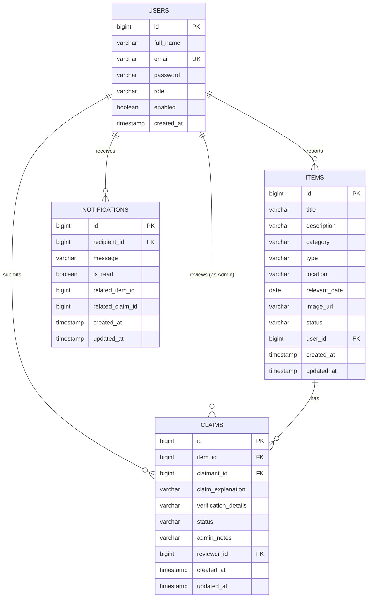

# CampusFind — Entity Relationship (ER) Diagram

```mermaid
erDiagram
    USERS ||--o{ ITEMS : "reports"
    USERS ||--o{ CLAIMS : "submits"
    USERS ||--o{ CLAIMS : "reviews (as Admin)"
    USERS ||--o{ NOTIFICATIONS : "receives"
    ITEMS ||--o{ CLAIMS : "has"

    USERS {
        bigint id PK
        varchar full_name
        varchar email UK
        varchar password
        varchar role
        boolean enabled
        timestamp created_at
    }

    ITEMS {
        bigint id PK
        varchar title
        varchar description
        varchar category
        varchar type
        varchar location
        date relevant_date
        varchar image_url
        varchar status
        bigint user_id FK
        timestamp created_at
        timestamp updated_at
    }

    CLAIMS {
        bigint id PK
        bigint item_id FK
        bigint claimant_id FK
        varchar claim_explanation
        varchar verification_details
        varchar status
        varchar admin_notes
        bigint reviewer_id FK
        timestamp created_at
        timestamp updated_at
    }

    NOTIFICATIONS {
        bigint id PK
        bigint recipient_id FK
        varchar message
        boolean is_read
        bigint related_item_id
        bigint related_claim_id
        timestamp created_at
        timestamp updated_at
    }
```
