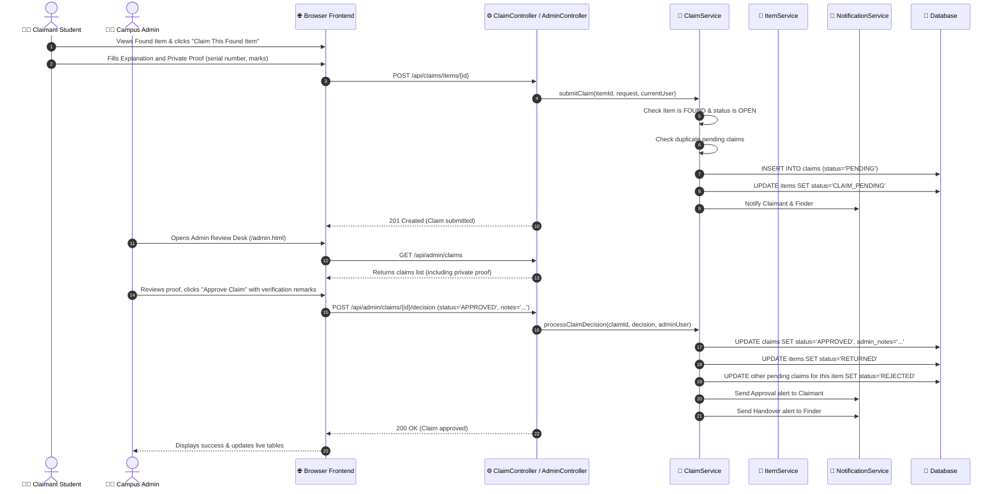

# CampusFind — Sequence Diagram: Claim Submission and Admin Approval

```mermaid
sequenceDiagram
    autonumber
    actor Claimant as 👨‍🎓 Claimant Student
    actor Admin as 👨‍💼 Campus Admin
    participant UI as 🌐 Browser Frontend
    participant ClaimCtrl as ⚙️ ClaimController / AdminController
    participant ClaimSvc as 💼 ClaimService
    participant ItemSvc as 💼 ItemService
    participant NotifSvc as 🔔 NotificationService
    participant DB as 💾 Database

    %% Step 1: Claim Submission
    Claimant->>UI: Views Found Item & clicks "Claim This Found Item"
    Claimant->>UI: Fills Explanation and Private Proof (serial number, marks)
    UI->>ClaimCtrl: POST /api/claims/items/{id}
    ClaimCtrl->>ClaimSvc: submitClaim(itemId, request, currentUser)
    ClaimSvc->>ClaimSvc: Check Item is FOUND & status is OPEN
    ClaimSvc->>ClaimSvc: Check duplicate pending claims
    ClaimSvc->>DB: INSERT INTO claims (status='PENDING')
    ClaimSvc->>DB: UPDATE items SET status='CLAIM_PENDING'
    ClaimSvc->>NotifSvc: Notify Claimant & Finder
    ClaimCtrl-->>UI: 201 Created (Claim submitted)

    %% Step 2: Admin Verification & Approval
    Admin->>UI: Opens Admin Review Desk (/admin.html)
    UI->>ClaimCtrl: GET /api/admin/claims
    ClaimCtrl-->>UI: Returns claims list (including private proof)
    Admin->>UI: Reviews proof, clicks "Approve Claim" with verification remarks
    UI->>ClaimCtrl: POST /api/admin/claims/{id}/decision (status='APPROVED', notes='...')
    ClaimCtrl->>ClaimSvc: processClaimDecision(claimId, decision, adminUser)
    ClaimSvc->>DB: UPDATE claims SET status='APPROVED', admin_notes='...'
    ClaimSvc->>DB: UPDATE items SET status='RETURNED'
    ClaimSvc->>DB: UPDATE other pending claims for this item SET status='REJECTED'
    ClaimSvc->>NotifSvc: Send Approval alert to Claimant
    ClaimSvc->>NotifSvc: Send Handover alert to Finder
    ClaimCtrl-->>UI: 200 OK (Claim approved)
    UI-->>Admin: Displays success & updates live tables
```
