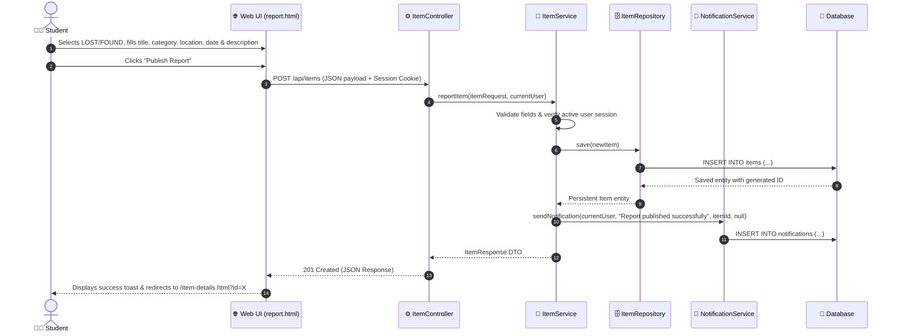

# CampusFind — Sequence Diagram: Reporting an Item

```mermaid
sequenceDiagram
    autonumber
    actor Student as 👨‍🎓 Student
    participant Browser as 🌐 Web UI (report.html)
    participant Controller as ⚙️ ItemController
    participant Service as 💼 ItemService
    participant Repo as 🗄️ ItemRepository
    participant Notif as 🔔 NotificationService
    participant DB as 💾 Database

    Student->>Browser: Selects LOST/FOUND, fills title, category, location, date & description
    Student->>Browser: Clicks "Publish Report"
    Browser->>Controller: POST /api/items (JSON payload + Session Cookie)
    Controller->>Service: reportItem(itemRequest, currentUser)
    Service->>Service: Validate fields & verify active user session
    Service->>Repo: save(newItem)
    Repo->>DB: INSERT INTO items (...)
    DB-->>Repo: Saved entity with generated ID
    Repo-->>Service: Persistent Item entity
    Service->>Notif: sendNotification(currentUser, "Report published successfully", itemId, null)
    Notif->>DB: INSERT INTO notifications (...)
    Service-->>Controller: ItemResponse DTO
    Controller-->>Browser: 201 Created (JSON Response)
    Browser-->>Student: Displays success toast & redirects to /item-details.html?id=X
```
