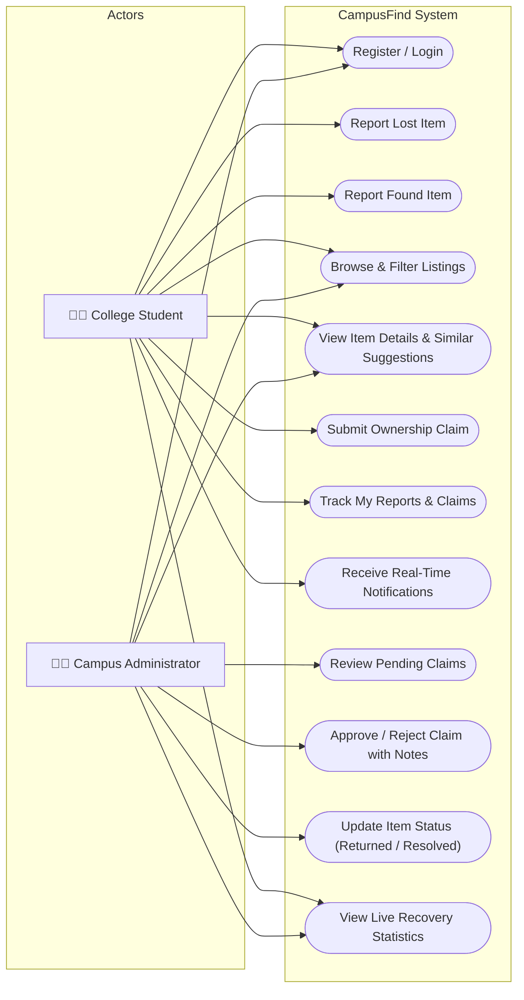

# CampusFind — Use Case Diagram

```mermaid
flowchart LR
    subgraph Actors
        Student["👨‍🎓 College Student"]
        Admin["👨‍💼 Campus Administrator"]
    end

    subgraph CampusFind System
        UC1(["Register / Login"])
        UC2(["Report Lost Item"])
        UC3(["Report Found Item"])
        UC4(["Browse & Filter Listings"])
        UC5(["View Item Details & Similar Suggestions"])
        UC6(["Submit Ownership Claim"])
        UC7(["Track My Reports & Claims"])
        UC8(["Receive Real-Time Notifications"])
        UC9(["Review Pending Claims"])
        UC10(["Approve / Reject Claim with Notes"])
        UC11(["Update Item Status (Returned / Resolved)"])
        UC12(["View Live Recovery Statistics"])
    end

    Student --> UC1
    Student --> UC2
    Student --> UC3
    Student --> UC4
    Student --> UC5
    Student --> UC6
    Student --> UC7
    Student --> UC8
    Student --> UC12

    Admin --> UC1
    Admin --> UC4
    Admin --> UC5
    Admin --> UC9
    Admin --> UC10
    Admin --> UC11
    Admin --> UC12
```
